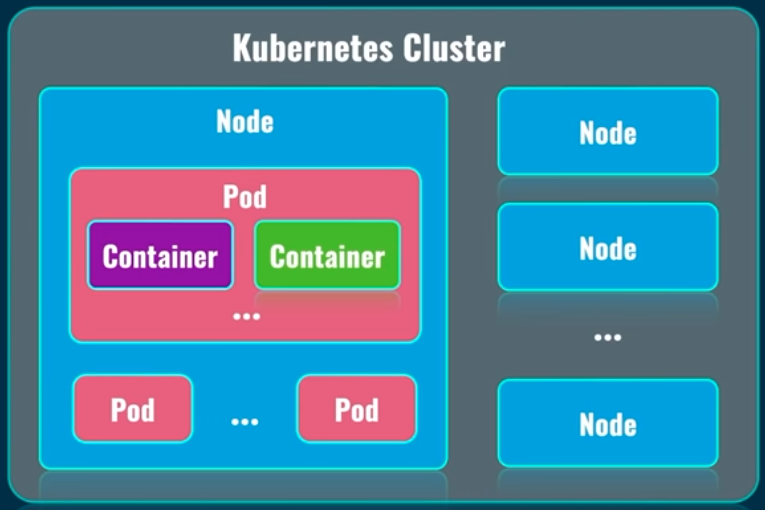
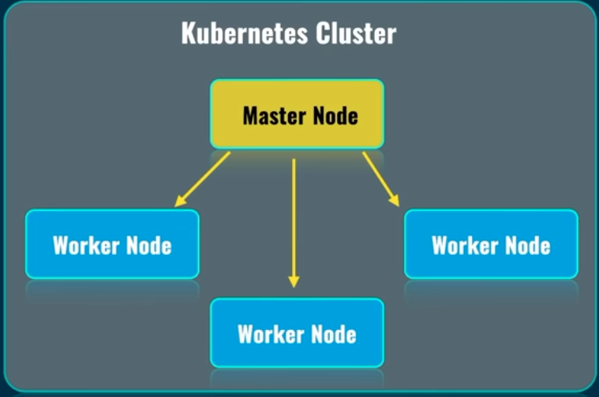
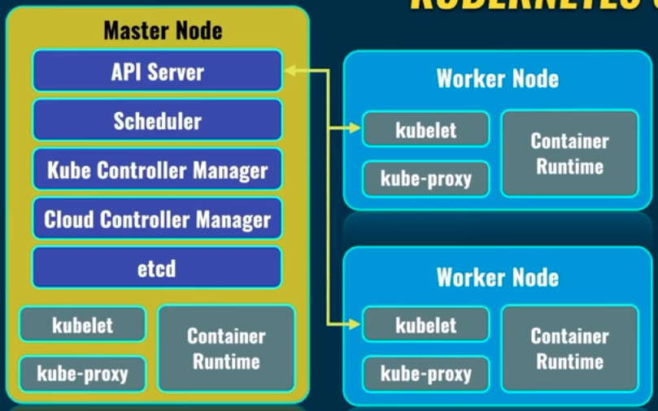
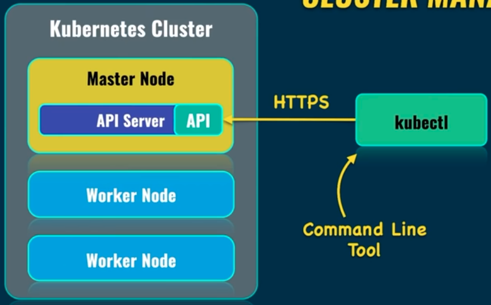

# Kubernetes Tutorial

Kubernetes (K8S) is a standard for deployment of the containerized applications into production. K8S is an open-source => it is free to use.

## What Is Kubernetes

K8S is a container orchestration system. K8S lets you create the containers on different servers, either physical or virtual. All of that is done automatically without your intevention. We just need to say to K8S how many containers we want to create based on specific image.

K8S takes care of:

- Automatic deployment of the containerized applications across different servers
- Distribution of the load across multiple servers
- Auto-scaling of the deployed applications
- Monitoring and health check of the containers
- Replacement of the failed containers

K8S supports following container runtimes:

- Docker
- CRI-O
- containerd

## POD

Pod is the smallest unit in the K8S world. Containers (one or many) are created inside of the pod.

- We can have multiple containers running inside one pod but the most common scenario is to have `a single container per pod`.
- namespace is meant to be a pod.
- Each pod must be located on the same server (onde pod, one server)

## K8S Cluster & Nodes

K8S cluster consists of nodes. Node is actually server either bare metals or virtual server. You can include multiple server to the K8S cluster. Most of the time the nodes which belongs to the same cluster are located close to each other in order to perform jobs more efficiently. Inside of the node there are pods. Pod is the smallest unit in the K8S. Each pod contain usually one container.

Our job is to create the nodes and cluster based on those nodes. Everything is automated after initial configuration and K8S will automatically deploy pods on different nodes.

How nodes comunicate to each other and how they manage?

There is a Master node in K8S cluster and other nodes in the cluster are worker nodes. Master node manages the worker nodes.It is a master node job to destribute eg. load across other worker nodes. Application is deplued to worker nodes only. Master node runs only system pods which are responsible for actuall work on the K8S cluster in general

## K8S Services

There are several services such as:

- kubelet
- kube-proxy
- Container Runtime (Docker, CRI-O or containerd)

Those services are present on each node in the k8s cluster.

- The kubelet service on each node communicates with an API service located in Master Node. API Service is a main point of communication in between nodes in the k8s world.
- Kube Proxy is responsible for network communication inside of each node and between nodes.
- Scheduler service is responsible for planning and distributing of the load between different nodes in the cluster.
- Kube Controller Manager is a single point which controls everything in K8S cluster.
- Cloud Controller Manager is for interaction with cloud service provider where you run your k8s cluster.
  - Loud Balancer is for opening your nodes to the world
- etcd service stores all logs related to operation of entire k8s cluster. Logs are stored as key-value pairs.
- Others service eg DNS. DNS provides connection to specific deployment by the name of the corresponding deployment service.

## What is kubectl

`kubectl` is a command line tool which allows you to connect to specific K8S cluster and manage it remotly. You can also manage remote k8s clusters.

;

## Software Required

- Minikube creates k8s cluster with single node and master node
  - We need Virtual box or Docker
- kubectl to connect and manage the cluster through master node

## Exploring the K8S Node

`minikube start --driver=docker` to run a minikube localy using docker engine (we might aslo use VirtualBox etc.). To remind, each node represents a virtual or bare server.

Each node in K8S cluster is just server either virtual or physical. To connect to node/server we use SSH protocol.

<b>Note:</b>

SSH stands for Secure Shell Protocol is a cryptographic network protocol for operating network services securely over an unsecured network. Its most notable applications are remote login and command-line execution. SSH applications are based on a client–server architecture, connecting an SSH client instance with an SSH server.

- `minikube ip` is to to find the IP address which was assigned to the node
- `ssh docker@<IP_ADDRESS>` this works only if you use a driver other than docker
- `kubectl cluster-info` to see if k8s control pane and CoreDNS are running. We can also run the same command with `minikube kibectl clister-info`
- `kubectl get nodes` to see a list of current nodes which are available in the k8s cluster.
- `kubectl get pods` to see a list of pods in the cluster
- `kubectl get namespaces` to see a list of the namespaces avaliable in the cluster

## Create a Single Pod

- `kubectl run nginx --image=nginx` to create a pod named nginx based on docker image nginx
- `kubectl describe pod nginx` to see details of the pod named nginex
- `kubectl get pods -o wide` to see more details like ip address of the pod about pod than using just `kubectl get pod`
- `kubectl delete pod nginx` to deleted existing pod named nginx

## Create Alias for the kubectl Command

`alias k=kubectl` to create a alias called k which represents the kubectl command. This lives only the current terminal session.

## Create & Explore Deployment

We use deployments to create a multiple pods when we can increase, decrease quantity of the pods or modify configuration etc. Deployment is responsible for creating those pods. Created pods will be absolutely the same and can be distributed across different nodes.

- `kubectl create deployment nginx-deployment --image=nginx` to create a deployment named nginx-deployment using docker image nginx
- `kubectl get deployments` to see all deployments

When we create a deployment, a pod is created automatically with the name of the deployment following a hascode - and specific hashcode for the pod eg.: nginx-deployment-794f656f8b-rmbsq

- `kubectl describe deployment nginx-deployment` to see details of the deployment of nginx-deployment
