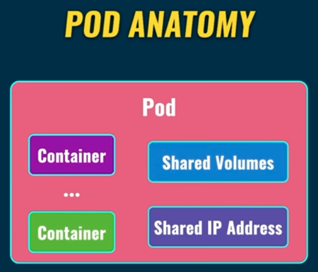

# Kubernetes Tutorial

Kubernetes (K8S) is a standard for deployment of the containerized applications into production. K8S is an open-source => it is free to use.

## What Is Kubernetes

K8S is a container orchestration system. K8S lets you create the containers on different servers, either physical or virtual. All of that is done automatically without your intevention. We just need to say to K8S how many containers we want to create based on specific image.

K8S takes care of:

- Automatic deployment of the containerized applications across different servers
- Distribution of the load across multiple servers
- Auto-scaling of the deployed applications
- Monitoring and health check of the containers
- Replacement of the failed containers

K8S supports following container runtimes:

- Docker
- CRI-O
- containerd

## POD

Pod is the smallest unit in the K8S world. Containers (one or many) are created inside of the pod.

- We can have multiple containers running inside one pod but the most common scenario is to have `a single container per pod`.
- namespace is meant to be a pod.
- Each pod must be located on the same server (onde pod, one server)
